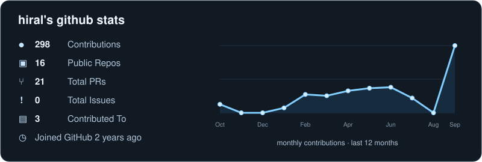

# hi, I'm Hiral!
### Computer Science and Electrical Engineering @ <a href="https://www.ucdavis.edu/">UC Davis</a>
I'm a software engineer who is passionate about making contributing to open-source more approachable, creating technology to elevate people, and building community. Some technologies I enjoy working with include ReactJS, Jamstack (JavaScript, APIs + Markup) and GraphQL.

## some stats-

  

## Wanna chat?

  📩 email me- <a href="mailto:hiral.arora.1418@gmail.com">hiral.arora.1418@gmail.com</a> or <a href="mailto:hirarora@ucdavis.edu">hirarora@ucdavis.edu</a> 
  🌐 see more of my work- <a href="https://hiral-arora.vercel.app/">hiral-arora.vercel.app</a> 
  🔗 sharing updates on my <a href="https://www.linkedin.com/in/hiral-aroraa/">LinkedIn @ hiral-aroraa</a> 
  💻 my github- <a href="https://github.com/hir-al-14">hir-al-14</a> 
  📃 view my <a href="https://drive.google.com/file/d/1VV8gPGp5mH2VUT8mNc8sFVfhm-v3dHgP/view?usp=sharing">Resume</a>

